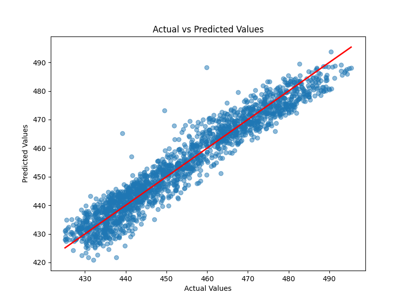

# Power Output Prediction
Power Output Prediction using Sklearn, FastAPI and Streamlit App

## Table of Contents
- [Description](#description)
- [Requirements](#requirements)
- [Getting Started](#getting-started)
  - [1. Train and Save the Model](#1-train-and-save-the-model)
  - [2. Deploy FastAPI](#2-deploy-fastapi)
  - [3. Run Streamlit](#3-run-streamlit)
- [Usage](#usage)
- [Endpoints](#endpoints)
- [Example Input and Output](#example-input-and-output)
- [File Structure](#file-structure)
- [License](#license)

## Description

This project provides an API and a Streamlit application for predicting power output (PE) based on environmental factors. The model uses Linear Regression from Scikit-Learn, trained on features including:

- Ambient Temperature (AT)
- Exhaust Vacuum (V)
- Ambient Pressure (AP)
- Relative Humidity (RH)

The API is deployed using FastAPI, and a Streamlit app provides an interactive interface for users to input values and get predictions.


## Requirements
To set up and run this project, you’ll need the following Python packages:

- `fastapi`
- `uvicorn`
- `scikit-learn`
- `pandas`
- `joblib`
- `numpy`
- `streamlit`

You can install these dependencies by running:
```bash
pip install -r requirements.txt
```

## Getting Started
Follow these steps to set up and run the project.

1. Train and Save Model

  Train a Linear Regression model using scikit-learn, and save the trained model to a file for deployment:
  ```bash
  python linear_regression_model.py
  ```
2. Deploy FastAPI
  The FastAPI application (`api.py`) loads the saved model and provides an endpoint for predictions. Run it using `uvicorn`:
  ```bash
  uvicorn api:app --reload
  ```
  This will start the FastAPI server at `http://127.0.0.1:8000`

3. Run Streamlit
The Streamlit app allows users to input values and retrieve predictions from the FastAPI server. To start Streamlit, run:
  ```bash
  streamlit run app.py
  ``` 
The Streamlit app will open in a browser window at `http://localhost:8501`.

## Usage

FastAPI Endpoints
- POST /predict
  - Description: Accepts environmental parameters and returns a predicted power output (PE).
  - Input JSON:
  ```bash
  {
    "AT": 15.0,
    "V": 40.0,
    "AP": 1000.0,
    "RH": 75.0
  }
  ```
  - Output JSON:
  ```bash
  {
    "prediction": 465.84
  }
  ```
  
### Streamlit Application

The Streamlit app provides an interface for users to input values for AT, V, AP, and RH. When the Predict button is clicked, the app sends the values to the FastAPI endpoint and displays the predicted power output (PE).

## Example Input and Output
Example Input:
AT = 15, V = 40, AP = 1000, RH = 75

Example Output:
Predicted Power Output (PE) = 465.84


## File Structure
The project directory is structured as follows:

```
📦 linear_regression_model
├─ data
│  └─ data.xlsx
├─ model
│  └─ model.pkl
├─ src
├─ .gitignore
├─ app.py
├─ api.py
├─ linear_regression_model.py
├─ README.md
└─ requirements.txt
```

## Power Output Visualizations

### Actual vs Predicted Values


## License
This project is licensed under [](https://opensource.org/licenses/MIT)